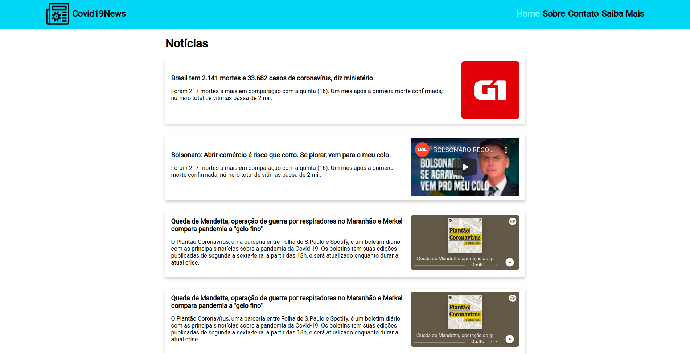

# News Covid19

## Description
News Covid-19 is a website to show the 6 better news about the covid-19. Done due to a challenge from Hiring Coders program.

The cards news was inspired in google news cards.

## Usage

First, clone project to you computer.

`git clone https://github.com/adhamlucas/news-covid19.git`

After that, go to the project folder and open the home.html.

### Acess

To acess the site, click here: [Covid19News](https://news-covid19-also.netlify.app/home.html)

